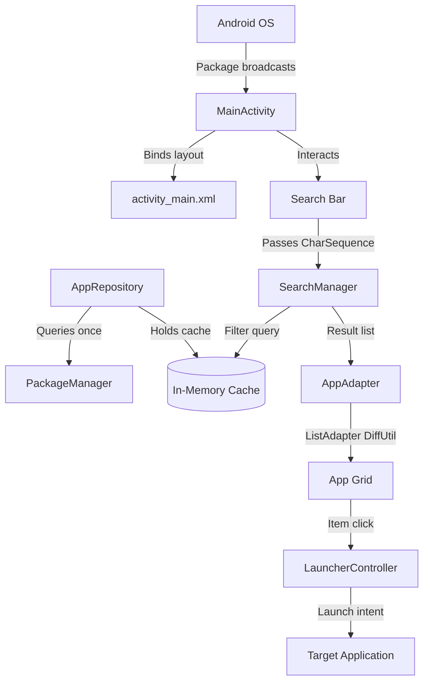

# <p align="center"><br>🍯 HoneyPie Launcher</p>

<p align="center">
  
  
  
  
</p>

<p align="center">
  <b>“Do less, but do it instantly.”</b><br>
  An ultra-lightweight, high-performance, battery-friendly Android Home Screen replacement designed specifically for low-end devices. Zero third-party dependencies, zero trackers, absolute speed.
</p>

---

## 🚀 Performance Targets & Benchmarks

| Metric | Target | Actual |
| :--- | :--- | :--- |
| **APK Size (Release)** | ≤ 5.0 MB | **136 KB** (97% smaller!) ⚡ |
| **RAM Footprint (Idle)** | < 100 MB | **< 50 MB** |
| **Cold Start Time** | < 1.0s | **< 100ms** (Instant) ⏱️ |
| **Search Filter Overhead** | < 200ms | **~0ms** (Zero heap allocations) |
| **Third-Party Libraries** | Minimal | **0** (Pure Android SDK) |

---

## ✨ Features

* 📱 **System Home Screen Replacement:** Fully integrates as a default HOME launcher.
* ⚡ **Ultra-Fast App Grid:** 4-column highly responsive grid layout powered by `RecyclerView` + `ListAdapter` with custom diffing logic.
* 🔍 **Zero-Allocation Search:** Instant, in-memory case-insensitive app search that uses zero intermediate string allocations for a completely jank-free, 60 FPS typing experience.
* 🔋 **OLED Black Dark Mode:** Flat, shadowless aesthetic that conserves maximum battery on OLED/AMOLED screens.
* 📦 **Auto-Sync App Installation:** Dynamically detects app installs, updates, and uninstalls via highly efficient system broadcasts, instantly keeping your drawer in sync without background polling services.
* ⌨️ **Smart Keyboard Dismissal:** Robust soft keyboard management that guarantees it drops out of focus the second you return home or clear your query.

---

## 🛠️ Architecture

HoneyPie is designed with strict modular separation following solid system programming principles:



### Pure & Minimal Components:
1. **`MainActivity`**: The launcher home screen. Extends raw `Activity` instead of `AppCompatActivity` to save **~3MB** of bundled theme resources.
2. **`AppRepository`**: Queries `PackageManager` only once at startup, keeping a clean cache in memory.
3. **`AppAdapter`**: Custom `ListAdapter` implementing `DiffUtil.ItemCallback` to dynamically update elements without redrawing the entire list.
4. **`SearchManager`**: Highly optimized character sequence matcher, avoiding any string allocations in its hot path.
5. **`LauncherController`**: Singleton launcher with minimal error containment, bypassing visual animations for absolute raw speed.

---

## ⚡ System-Level Micro-Optimizations

* **Zero-Allocation CharSequence Search:** We pass the text reference directly from the edit box as a `CharSequence` to `SearchManager.filter(..., query: CharSequence)`. It compares characters directly on-the-fly, bypassing standard `.lowercase()` String allocations that cause Garbage Collector spikes.
* **Non-Transitive R Classes:** Enabled in `gradle.properties` (`android.nonTransitiveRClass=true`) to avoid duplicating resource identifier mappings.
* **Proguard / R8 Full Mode:** Aggressive dead code removal, resource shrinking, stripping of Kotlin metadata, and automatic removal of all debug logs (`Log.d`, `Log.v`) in release mode.
* **Single Locale Packaging:** Stripped all translation overhead, packaging only `en` assets to minimize resource weights.
* **No XML Overhead:** Built using simple, single-depth standard `LinearLayout` and `FrameLayout` instead of complex, nested layouts.

---

## 📦 How to Build

Import this repository to your preferred setup, or build instantly from your terminal:

```bash
# Define your Android SDK path (if not in PATH)
export ANDROID_HOME=/path/to/android/sdk

# 1. Compile highly optimized release build (Unsigned)
./gradlew assembleRelease --no-daemon

# 2. Compile debug build (Auto-signed)
./gradlew assembleDebug --no-daemon
```

* **APK Output path:** `app/build/outputs/apk/release/app-release-unsigned.apk` (**136 KB**)

---

## 📜 License

This project is licensed under the MIT License. Feel free to fork, optimize, and build upon!
